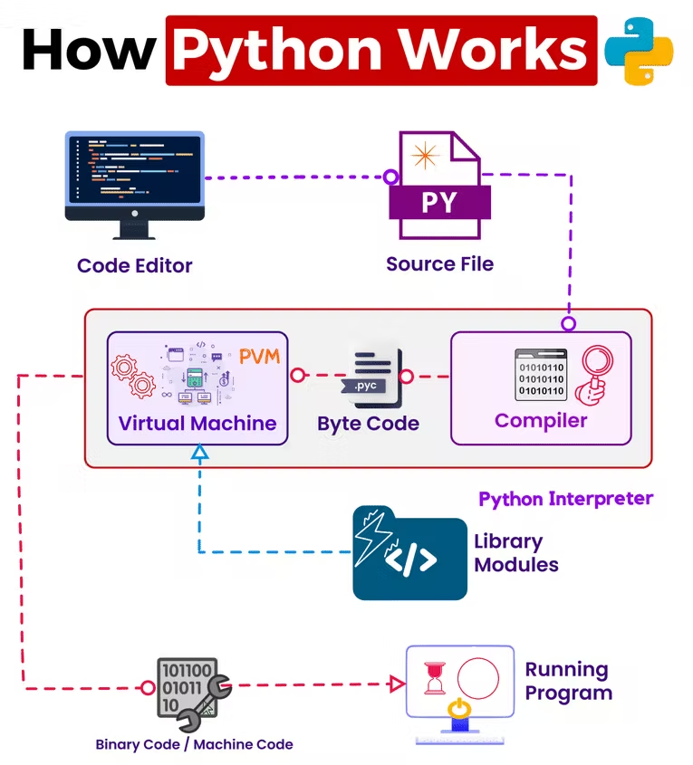
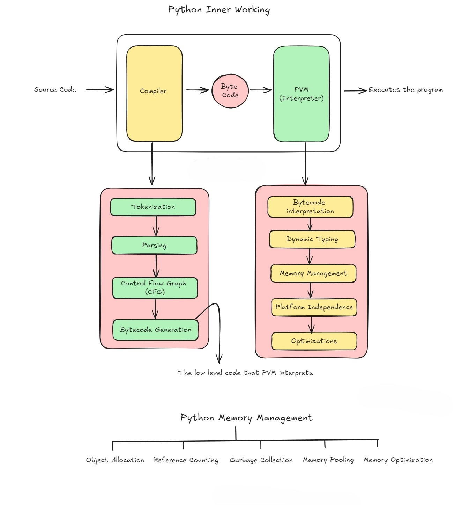

# Internal Working Of Python

    

### **1. Source Code**

- When you write a Python script, it’s human-readable text. This source code is the starting point for everything.
- Your Python source code, written in a `.py` file, is human-readable. This code defines what your program does, specifying variables, functions, loops, and so on.

### **2. Compilation to Bytecode (compiler)**

When you run a Python program, the first step is to compile the source code to bytecode. This is done by the Python interpreter:

* **Syntax Check** : Ensures there are no syntax errors.
* **Compilation** : Translates the high-level source code into bytecode, a lower-level, platform-independent representation. This bytecode typically resides in `.pyc` files within the `__pycache__` directory.
  **Compiler** : Python uses an interpreter, but it first compiles your source code into a lower-level form known as bytecode.
* **Tokenizing** : Breaks down your code into small pieces called tokens (like keywords, operators, identifiers).
* **Parsing** : Analyzes the tokens to ensure they follow Python's syntax rules.
* **Control Flow Graph (CFG)** : Represents all paths that might be traversed through a program during its execution.
* **Bytecode Generation** : Converts the parsed tokens into bytecode, a set of instructions for the Python Virtual Machine (PVM).

---

Let’s deep dive this

 **Python Compiler** : Even though Python is known as an interpreted language, it does have a compilation step. Here’s the breakdown:

* **Tokenization** :
  Breaks down your code into small pieces called tokens (like keywords, operators, identifiers).

1. **Source Code** : Starts with your written code.
2. **Tokenizer (Lexer)** : This breaks the source code into smaller pieces called tokens, like keywords (`for`, `if`), operators (`+`, ``), identifiers (variable names), and literals (like numbers or strings).
3. **Parsing** :Analyzes the tokens to ensure they follow Python's syntax rules.
4. **Syntax Analysis** : The parser takes these tokens and checks them against Python's grammar rules.
5. **Parse Tree** : Builds a tree structure from the tokens, representing the grammatical structure of the code.
6. **Semantic Analysis** : Ensures the code makes sense in terms of data types, scope, and other context-specific rules.
7. **Control Flow Graph (CFG)** : Represents all paths that might be traversed through a program during its execution.
   a. **Control Flow Graph** : Represents all possible paths that might be taken through the code during execution.
   b. **Nodes and Edges** : Each node represents a basic block of code, and edges represent the flow of control from one block to another.
8. **Bytecode Generation** :  **Converts the parsed tokens into bytecode, a set of instructions for the Python Virtual Machine (PVM).**
   The bytecode is a more compact, lower level representation of your source code, optimized for execution. It’s platform-independent, meaning it can be run on any system with a compatible PVM.
   a. **Bytecode** : The parsed code is converted into bytecode, a lower-level, platform-independent representation.
   b. **Instruction Set** : This bytecode is a set of instructions that the Python Virtual Machine (PVM) can execute. Bytecode is stored in `.pyc` files in the `__pycache__` directory to speed up future executions.

### **3. Loading Bytecode (Byte code)**

After compilation, the Python Virtual Machine loads the bytecode:

* **Reading from Cache** : If the bytecode has been previously compiled and hasn’t changed, it’s read from the cache (`__pycache__`) (mostly visible when we imported the code) .This speeds up execution by skipping the compilation step.
* The bytecode is loaded into memory, ready to be executed.
  The bytecode is then executed by the PVM, interpreting the instructions to perform the program’s tasks.

### **4. Execution by PVM (PVM)**

The PVM now interprets and executes the bytecode:

* **Instruction Execution** : The PVM reads each bytecode instruction and executes it. Each instruction corresponds to a specific operation, like loading a value, performing arithmetic, or calling a function.
* #### **Memory Management** : Manages allocation and deallocation of memory for variables and objects.

  ### **Memory Management in Python** :

  1. **Reference Counting : Python keeps track of how many references there are to an object in memory.When the reference count drops to zero, the memory occupied by the object can be reclaimed.**
  2. **Object Allocation : Python objects (like integers, strings, lists) are created in memory when the code is run.**
  3. **Garbage Collection : Python has a garbage collector that helps manage memory by deallocating memory that is no longer in use (i.e., objects with a reference count of zero).**
  4. **Memory Pooling : Python uses pools of memory to allocate small objects more efficiently. This pooling helps reduce the overhead of frequently allocating and deallocating small chunks of memory.**
  5. **Memory Optimization : Python applies various optimizations to minimize memory usage, such as:**

     * **The PVM performs various runtime optimizations to improve efficiency, such as just-in-time (JIT) compilation in some implementations (like PyPy).**
     * **Reusing small integers and interned strings.**
     * **Efficiently managing data structures (e.g., tuples, lists, dictionaries).**

     Examples :

     ***Bytecode Caching**
     The PVM caches compiled bytecode to avoid recompiling the source code every time. This speeds up subsequent runs.

     ***Constant Folding**
     This involves simplifying constant expressions at compile time rather than runtime. For example,`3 * 2` might be precomputed to `6`.

So, in summary: the PVM is like an orchestra conductor, seamlessly turning the bytecode into actions that your computer can execute. The beautiful thing about it is that Python code, thanks to the PVM, is portable and can run on different platforms without modification.


## How can we see byte code generated or not??

When you import a Python module, Python compiles the source code into bytecode and stores it in the __pycache__ directory. This helps speed up future imports by avoiding the need to recompile the module each time it's imported.

Here's the process:

First Import: When you first import a module, Python compiles the .py file into bytecode.

pycache Directory: The bytecode is stored in the __pycache__ directory, named something like module_name.cpython-312.pyc.     # 312 is the python version

Subsequent Imports: On subsequent imports, Python checks the __pycache__ directory for the compiled bytecode and uses it if the source code hasn't changed, speeding up the import process.

### Example:

we have byte.py  when we import code from hello_world.py  after execution of byte.py we can see there will be a directory __pycache__ in that particular folder we can see .pyc files

```python
from hello_world import greet

greet("Byte code")

```

### By using py_compile

py_compile module, which allows you to compile Python source files into bytecode files. This is a handy way to speed up script execution for future runs.

In byte.py

```python
import py_compile

py_compile.compile('hello_world.py')

```

- The py_compile module compiles hello_world.py into bytecode.
- The resulting bytecode is stored in the __pycache__ directory, creating a file named hello_world.cpython-38.pyc (or similar, depending on your Python version).

#### Generating Bytecode:

- The whole script is executed to generate the bytecode. This means any top-level code (like print("Hello, World!") and print("c")) will run during the compilation process.

#### Resulting Bytecode:

- The bytecode contains all functions, classes, and executable statements, which Python uses to speed up future imports of the script.

### dis module

The dis module in Python is used to disassemble bytecode into a more readable form. This can help you understand what your Python code is doing under the hood. It’s especially useful for debugging or learning about the internals of Python.

- In  internal.py we have

```python
# Import the dis module which supports the analysis of CPython bytecode
import dis

# Define a simple function to illustrate Python's internals
def greet(name):
    # A simple print statement that is more complex than it looks
    print(f'Hello, {name}!')

# Disassemble the greet function to see what's happening under the hood
def disassemble_function():
    dis.dis(greet)

# Call the disassemble function
disassemble_function()

```

### output

```
 5           0 LOAD_GLOBAL              0 (print)
              2 LOAD_CONST               1 ('Hello, ')
              4 LOAD_FAST                0 (name)
              6 FORMAT_VALUE             0
              8 BUILD_STRING             2
             10 CALL_FUNCTION            1
             12 POP_TOP
             14 LOAD_CONST               0 (None)
             16 RETURN_VALUE
```

- The program begins by importing the dis module, a powerful tool for analyzing CPython bytecode. CPython is the default implementation of Python and bytecode is an intermediate language for the Python interpreter.
- Next, I’ve defined a simple function called greet. This function takes in a parameter name and prints out a greeting. Though the function itself is quite straightforward, what happens under the hood in Python is more intricate than it might seem on the surface.
- The disassemble_function function makes use of dis.dis() to disassemble the greet function. dis.dis() translates Python functions into the low-level bytecode that Python’s virtual machine actually executes. This bytecode is Python’s interpretation of our greet function and is a step closer to machine code.
- When the script calls disassemble_function(), the console output presents the bytecode of our greet function.

Here’s what the bytecode tells us:

- LOAD_GLOBAL(0): This opcode is used to load the global variable, which, in this case, is the print function.
- LOAD_CONST(1): This loads the constant value ‘Hello, ‘ onto the stack.
- LOAD_FAST(0): This opcode loads the local variable name onto the stack.
- FORMAT_VALUE(0): This formats our name string, preparing it to be inserted into the string that’s about to be built.
- BUILD_STRING(2): This takes the top two values on the stack (‘Hello, ‘ and name) and builds the final string.
- CALL_FUNCTION(1): This line calls the function (global print function that we loaded onto the stack), with the argument count in parentheses (we have one argument, our formatted string).
- POP_TOP: This removes the top of the stack (the result of the previous call, since print returns None).
- LOAD_CONST(0): Loads None.
- RETURN_VALUE: This is the return value of the greet function, which, since there is no explicit return statement, is None.
- In essence, the bytecode shows the individual operations that Python performs to execute our greet function. Understanding these instructions is crucial for developers to understand how Python executes code, optimizes functions, and manages resources—all of this happening seamlessly under the hood when we run our Python code.
