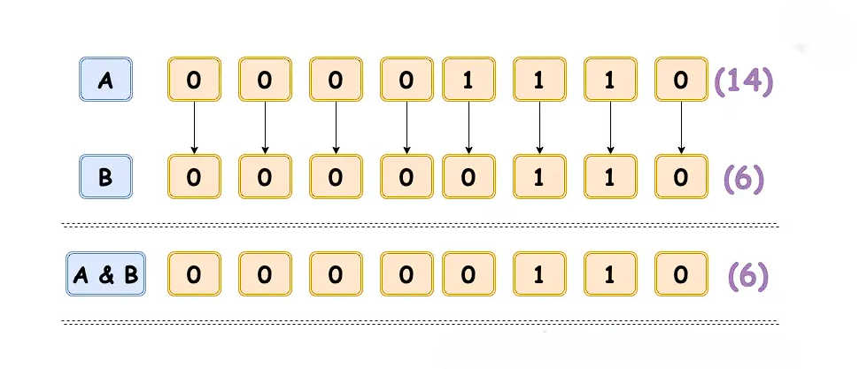
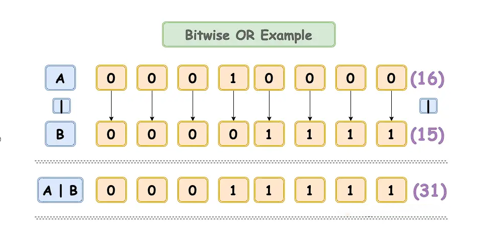
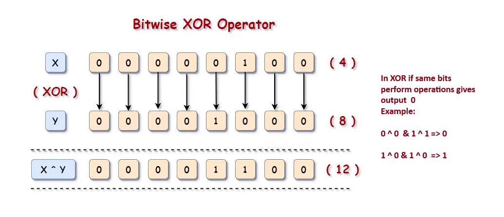
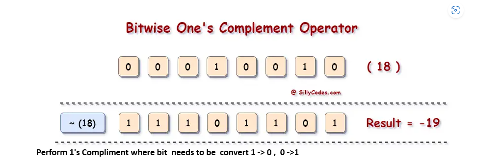
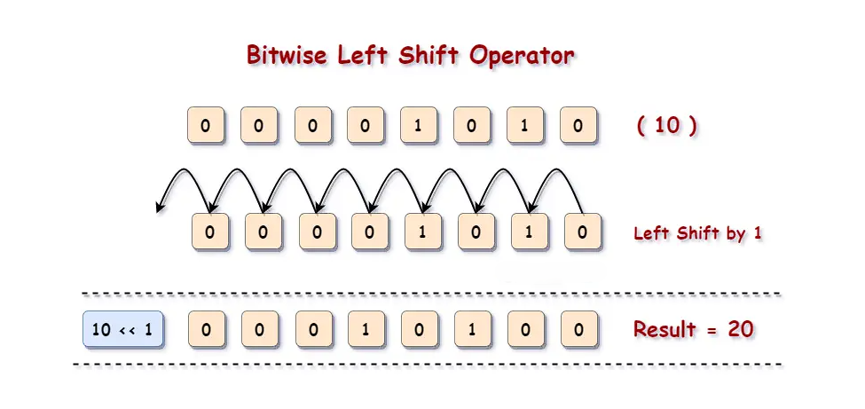
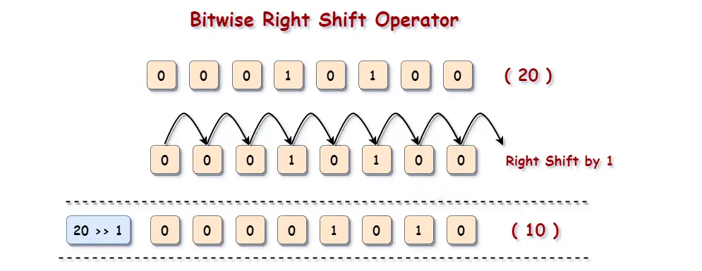

### What are Operators?

Operators are special symbols or keywords in programming that perform operations on variables and values. They are the building blocks of programming logic, allowing us to manipulate data and variables to carry out computations, comparisons, and logical decisions.

### Why We Need to Use Operators

Operators are crucial because they:

- Enable Calculations: Perform arithmetic operations like addition, subtraction, multiplication, etc.
- Facilitate Comparisons: Compare values to make decisions based on conditions.
- Implement Logic: Help in combining multiple conditions using logical operations.
- Modify Values: Update variable values through assignment and arithmetic operations.
- Work with Bits: Perform low-level bit manipulation necessary for performance-critical tasks.
<br/>

**Arithmetic Operators**

| **Operator** | **Name** | **Example**  |
| ------------------ | -------------- | ------------------ |
| `+`              | Addition       | `5 + 3 = 8`      |
| `-`              | Subtraction    | `5 - 3 = 2`      |
| `*`              | Multiplication | `5 * 3 = 15`     |
| `/`              | Division       | `5 / 3 = 1.6667` |
| `//`             | Floor Division | `5 // 3 = 1`     |
| `%`              | Modulus        | `5 % 3 = 2`      |
| `**`             | Exponentiation | `5 ** 3 = 125`   |

<br/>

- Arithmetic operators are used to perform basic mathematical operations.
- Addition (+): Adds two values. Example: 5 + 3 = 8
- Subtraction (-): Subtracts the right value from the left. Example: 5 - 3 = 2
- Multiplication (*): Multiplies two values. Example: 5 * 3 = 15
- Division (/): Divides the left value by the right. Example: 5 / 3 = 1.6667
- Floor Division (//): Divides and returns the largest integer less than or equal to the result. Example: 5 // 3 = 1
- Modulus (%): Returns the remainder of the division. Example: 5 % 3 = 2
- Exponentiation (**): Raises the left value to the power of the right value. Example: 5 ** 3 = 125

<br/>

**Comparison Operators**

| **Operator** | **Name**           | **Example**  |
| ------------------ | ------------------------ | ------------------ |
| `==`             | Equal to                 | `5 == 3` (False) |
| `!=`             | Not equal to             | `5 != 3` (True)  |
| `>`              | Greater than             | `5 > 3` (True)   |
| `<`              | Less than                | `5 < 3` (False)  |
| `>=`             | Greater than or equal to | `5 >= 3` (True)  |
| `<=`             | Less than or equal to    | `5 <= 3` (False) |


<br/>

- Comparison operators are used to compare two values.
- Equal to (==): Checks if two values are equal. Example: 5 == 3 (False)
- Not equal to (!=): Checks if two values are not equal. Example: 5 != 3 (True)
- Greater than (>): Checks if the left value is greater than the right. Example: 5 > 3 (True)
- Less than (<): Checks if the left value is less than the right. Example: 5 < 3 (False)
- Greater than or equal to (>=): Checks if the left value is greater than or equal to the right. Example: 5 >= 3 (True)
- Less than or equal to (<=): Checks if the left value is less than or equal to the right. Example: 5 <= 3 (False)

<br/>

**Logical Operators**

| **Operator** | **Name** | **Example**          |
| ------------------ | -------------- | -------------------------- |
| `and`            | Logical AND    | `True and False` (False) |
| `or`             | Logical OR     | `True or False` (True)   |
| `not`            | Logical NOT    | `not True` (False)       |

- Logical operators are used to combine conditional statements.
- Logical AND (and): Returns True if both statements are true. Example: True and False (False)
- Logical OR (or): Returns True if one of the statements is true. Example: True or False (True)
- Logical NOT (not): Reverses the result, returns False if the result is true. Example: not True (False)

<br/>

**Assignment Operators**

| **Operator** | **Name**          | **Example**                    |
| ------------------ | ----------------------- | ------------------------------------ |
| `=`              | Assign                  | `a = 5`                            |
| `+=`             | Add and assign          | `a += 3` (same as `a = a + 3`)   |
| `-=`             | Subtract and assign     | `a -= 3` (same as `a = a - 3`)   |
| `*=`             | Multiply and assign     | `a *= 3` (same as `a = a * 3`)   |
| `/=`             | Divide and assign       | `a /= 3` (same as `a = a / 3`)   |
| `%=`             | Modulus and assign      | `a %= 3` (same as `a = a % 3`)   |
| `//=`            | Floor divide and assign | `a //= 3` (same as `a = a // 3`) |
| `**=`            | Exponentiate and assign | `a **= 3` (same as `a = a ** 3`) |

<br/>

- Assignment operators are used to assign values to variables.
- Assign (=): Assigns a value to a variable. Example: a = 5
- Add and assign (+=): Adds and assigns the result to a variable. Example: a += 3 (same as a = a + 3)
- Subtract and assign (-=): Subtracts and assigns the result to a variable. Example: a -= 3 (same as a = a - 3)
- Multiply and assign (*=): Multiplies and assigns the result to a variable. Example: a *= 3 (same as a = a * 3)
- Divide and assign (/=): Divides and assigns the result to a variable. Example: a /= 3 (same as a = a / 3)
- Modulus and assign (%=): Applies modulus and assigns the result to a variable. Example: a %= 3 (same as a = a % 3)
- Floor divide and assign (//=): Applies floor division and assigns the result to a variable. Example: a //= 3 (same as a = a // 3)
- Exponentiate and assign (**=): Raises to a power and assigns the result to a variable. Example: a **= 3 (same as a = a ** 3)

<br/>

**Membership Operators**

| **Operator** | **Name** | **Example**             |
| ------------------ | -------------- | ----------------------------- |
| `in`             | Membership     | `'a' in 'apple'` (True)     |
| `not in`         | Non-membership | `'b' not in 'apple'` (True) |

<br/>

- Membership operators are used to test if a sequence contains a specific value.
- in: Returns True if a sequence contains the specified value. Example: 'a' in 'apple' (True)
- not in: Returns True if a sequence does not contain the specified value. Example: 'b' not in 'apple' (True)

<br/>

**Identity Operators**

| **Operator** | **Name** | **Example** |
| ------------------ | -------------- | ----------------- |
| `is`             | Identity       | `a is b`        |
| `is not`         | Non-identity   | `a is not b`    |

<br/>

- Identity operators are used to compare the memory locations of two objects.
- is: Returns True if two variables are the same object. Example: a is b
- is not: Returns True if two variables are not the same object. Example: a is not b
<br/>

**Bitwise Operators**

| **Operator** | **Name** | **Example** |
| ------------------ | -------------- | ----------------- |
| `&`              | AND            | `5 & 3` (1)     |
| `                  | `              | OR                |
| `^`              | XOR            | `5 ^ 3` (6)     |
| `~`              | NOT            | `~5` (-6)       |
| `<<`             | Left shift     | `5 << 1` (10)   |
| `>>`             | Right shift    | `5 >> 1` (2)    |

<br/>


**Bitwise Operations Table**


| **INPUT A**       | **Input B**       | **AND (`&`)**         | **OR (`\|`)**        | **XOR (`^`)**         | **Example**               |
| ----------------- | ----------------- | --------------------- | -------------------- | --------------------- | ---------------------------- |
| 0                 | 0                 | 0                     | 0                    | 0                     | `0b0000 & 0b0000 = 0b0000` |
| 0                 | 1                 | 0                     | 1                    | 1                     | `0b0000 & 0b0001 = 0b0000` |
| 1                 | 0                 | 0                     | 1                    | 1                     | `0b0001 & 0b0000 = 0b0000` |
| 1                 | 1                 | 1                     | 1                    | 0                     | `0b0001 & 0b0001 = 0b0001` |


<br/>


- Bitwise operators are used to perform bit-level operations on binary numbers.
- AND (&): Performs a bitwise AND operation. 
   
      Example: 5 & 3 (1)
            0101 & 0011 --> 0001


- OR (|): Performs a bitwise OR operation.
     
      Example: 5 | 3 (7)
              0101 | 0011 --> 0111


- XOR (^): Performs a bitwise XOR operation.
       
       Example: 5 ^ 3 (6)
                0101 ^ 0011 --> 0110


- NOT (~): Performs a bitwise NOT operation.

        Example: ~5 (-6)

- Left shift (<<): Shifts the bits of the left operand left by the number of positions specified by the right operand. 

      Example: 5 << 1 (10)


- Right shift (>>): Shifts the bits of the left operand right by the number of positions specified by the right operand.
       Example: 5 >> 1 (2)

<br/>














**Bitwise Operations Table**

<br/>

| **Operation**  | **Input** | **Binary Representation** | **Output**                     |
| -------------------- | --------------- | ------------------------------- | ------------------------------------ |
| AND (`&`)          | 5 & 3           | 0b0101 & 0b0011                 | 0b0001 (1)                           |
| OR (`\|`)           | 5\| 3           | 0b0101\| 0b0011                 | 0b0111 (7)                           |
| XOR (`^`)          | 5 ^ 3           | 0b0101 ^ 0b0011                 | 0b0110 (6)                           |
| NOT (`~`)          | ~5              | ~0b0101                         | 0b1010 (-6, in 4-bit representation) |
| Left Shift (`<<`)  | 5 << 1          | 0b0101 << 1                     | 0b1010 (10)                          |
| Right Shift (`>>`) | 5 >> 1          | 0b0101 >> 1                     | 0b0010 (2)                           |

The representation `0b100` is also a binary representation of a number. In Python, the prefix `0b` or `0B` is used to denote that the number is in binary format.

Here’s how to interpret it:

- **0b**: Indicates that the number following it is in binary form.
- **100**: The actual binary digits.

So, `0b100` in binary translates to:

- 0b is the binary representation and 100 are the acutal number

* 1 x 2^2 = 4
* 0 × 2^1=0
* 0 x 2^0 = 0

- Each bit is indeed multiplied by a power of 2 based on its position in the binary sequence
- Adding these values together, `0b100` is equal to 4 in decimal.

This prefix (`0b`) is specific to Python and some other programming languages to differentiate binary numbers from decimal, octal, or hexadecimal numbers.

<br/>

### Walrus Operator

- The Walrus operator (:=), introduced in Python 3.8, allows assignment of a value to a variable as part of an expression. or we can say
  Walrus operators (:=) allows you to assign a value to variable as a part of expression
- By using walrus the readility of code reduces.

<br/>

### With out walrus

```python
x=10
if x>s:
    print(x)

```

output: 10

### With walrus operater

```python
if(x:=10) >5:
    print(x)

```

output: 10
