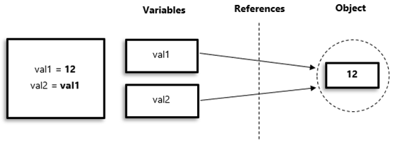
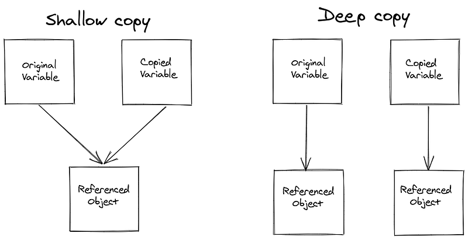

# How To Copy Objects

### Key Differences:

* **Assignment Operator** : Both variables refer to the same object (shared reference).
* **Shallow Copy** : Copies the top-level structure, but not the nested objects.
* **Deep Copy** : Recursively copies all nested objects, creating an independent copy.

### 1. Using Assignment operator

Assignment operator: It creates a reference, making both variables point to the same object in memory ( **assignment is the process of binding an object to a variable** )
the assignment operator `=` does not actually create a copy of the object; instead, it creates a new reference to the same object in memory.

**Shared Reference:**

Changes made through one variable affect the other since they both share the same memory.

involves only mutable objects only



```python
# referencing

list1=[1,2,[3,5],4]
list2=list1
list2[3]=7
list2[2].append(6)

print(list1)  # [1, 2, [3, 5, 6], 7]
print(list2)  # [1, 2, [3, 5, 6], 7]
```

Need for copying: To create independent copies python offers the copy module for shallow and deep copies

Types of copy

1. Shallow copy:
2. Deep copy




## Shallow copy

Shallow copy creates  a new object but it will not fully duplicates the object but only copies references for nested objects, so changes in nested objects affect both copies.

Syntax

```python
from copy import copy
l2=copy(list)
```

Example:

```python
# shallow copy 
from copy import copy

list1=[1,2,[3,5],4]
list2=copy(list1)  # copying the list

# changing the element in list2
list2[3]=7
# adding the element in list2
list2[2].append(6)

# original list
print(list1)      #[1, 2, [3, 5, 6], 4]
# copied list
print(list2)       # [1, 2, [3, 5, 6], 7]

```

## Deep copy

Deep copy creates  a fully independent copy, including all nested objects, using `deepcopy`  from copy module

deep copy copies all object recursively so changes in the copy do not affect the original.

syntax:

```python
from copy import deep copy
l2=deepcopy(list)
```

Example:

```python
# deep copy

from copy import deepcopy
list1=[1,2,[3,5],4]
list3=deepcopy(list1) 

# changing the element from index 3
list3[3]=7

# Adding the element
list3[2].append(6)

print(list1)  #[1, 2, [3, 5], 4]
print(list2)    # [1, 2, [3, 5, 6], 7]
```
