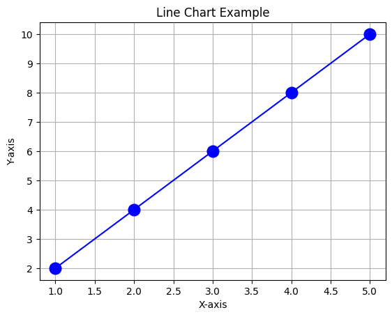
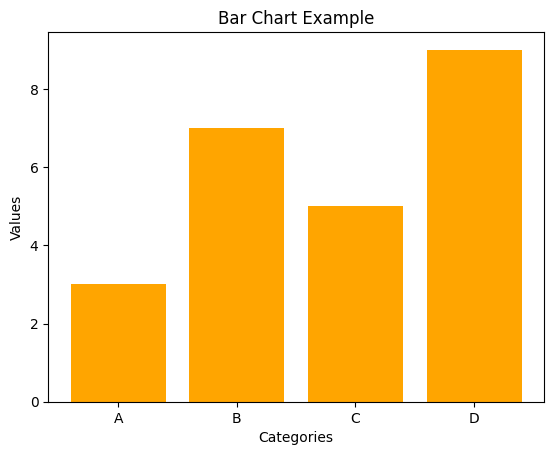
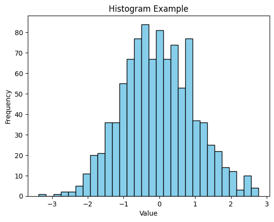
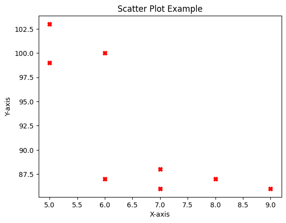
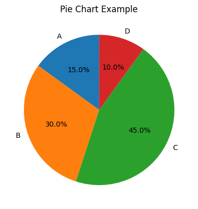
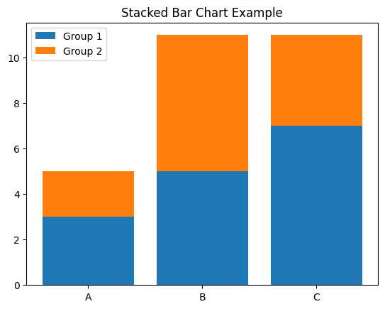
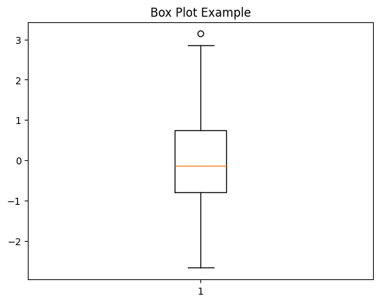
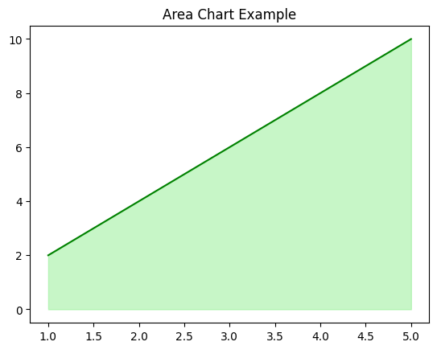
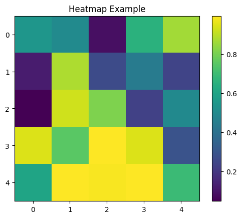
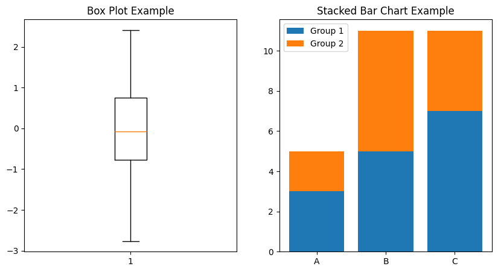

# Matplotlib

### What is matplotlib?

A matplotlib is a python library usedd for creating static, animated, and interactive plots

Data visualization : It's the graphical representation of data to identify patterns , trends and insights.

## 🔹 Why Use Charts?

Charts help in:

- Visualizing **patterns and trends**
- Comparing **categories or groups**
- Showing **relationships between variables**
- Understanding **distribution and spread**
- Communicating insights **clearly and effectively**


## Matplotlib Cheat Sheet (Functions)

* `plt.plot(x, y)` → Line chart
* `plt.bar(x, y)` → Bar chart
* `plt.hist(data, bins)` → Histogram
* `plt.scatter(x, y)` → Scatter plot
* `plt.pie(sizes, labels)` → Pie chart
* `plt.boxplot(data)` → Box plot
* `plt.fill_between(x, y)` → Area chart
* `plt.imshow(matrix)` → Heatmap

---

## Common Chart Types in Matplotlib

### 1. **Line Chart**

- **Best for:** Trends over time, continuous data.
- **Pros:** Simple, shows progression clearly.
- **Cons:** Not suitable for categorical comparisons.

```python
import matplotlib.pyplot as plt

x = [1, 2, 3, 4, 5]
y = [2, 4, 6, 8, 10]

plt.plot(x, y, marker='o', linestyle='-', color='b',markersize=12)
plt.title("Line Chart Example")
plt.xlabel("X-axis")
plt.ylabel("Y-axis")
plt.grid(True)
plt.show()

```



### 2. **Bar Chart**

* **Best for:** Comparing categories or discrete groups.
* **Pros:** Easy to compare values.
* **Cons:** Not good for continuous data.

```python
categories = ["A", "B", "C", "D"]
values = [3, 7, 5, 9]

plt.bar(categories, values, color='orange')
plt.title("Bar Chart Example")
plt.xlabel("Categories")
plt.ylabel("Values")
plt.show()
```



### 3. **Histogram**

* **Best for:** Showing distribution of data (frequency).
* **Pros:** Great for statistical analysis.
* **Cons:** Can be misleading if bin size is chosen poorly.

```python
import numpy as np

data = np.random.randn(1000)

plt.hist(data, bins=30, color='skyblue', edgecolor='black')
plt.title("Histogram Example")
plt.xlabel("Value")
plt.ylabel("Frequency")
plt.show()
```



### 4. **Scatter Plot**

* **Best for:** Showing relationships or correlation between two variables.
* **Pros:** Highlights clusters, outliers, and correlations.
* **Cons:** Hard to interpret with too many points.

```python
x = [5, 7, 8, 7, 6, 9, 5, 6]
y = [99, 86, 87, 88, 100, 86, 103, 87]

plt.scatter(x, y, color='red', marker='x')
plt.title("Scatter Plot Example")
plt.xlabel("X-axis")
plt.ylabel("Y-axis")
plt.show()
```



### 5. **Pie Chart**

* **Best for:** Showing proportions or percentages of a whole.
* **Pros:** Easy to understand proportions.
* **Cons:** Not precise for detailed comparisons.

```python
sizes = [15, 30, 45, 10]
labels = ["A", "B", "C", "D"]

plt.pie(sizes, labels=labels, autopct='%1.1f%%', startangle=90)
plt.title("Pie Chart Example")
plt.show()
```



### 6. **Stacked Bar Chart**

* **Best for:** Comparing categories with sub-categories.

```python
import numpy as np

categories = ["A", "B", "C"]
values1 = [3, 5, 7]
values2 = [2, 6, 4]

plt.bar(categories, values1, label="Group 1")
plt.bar(categories, values2, bottom=values1, label="Group 2")
plt.title("Stacked Bar Chart Example")
plt.legend()
plt.show()
```



### **Box Plot (Whisker Plot)**

* **Best for:** Showing spread, quartiles, and outliers.

```python

import numpy as np
import random

data = np.random.randn(100)

plt.boxplot(data)
plt.title("Box Plot Example")
plt.show()
```



### 8. **Area Chart**

* **Best for:** Cumulative trends over time.

```python
x = [1, 2, 3, 4, 5]
y = [2, 4, 6, 8, 10]

plt.fill_between(x, y, color="lightgreen", alpha=0.5)
plt.plot(x, y, color="green")
plt.title("Area Chart Example")
plt.show()
```



### 9. **Heatmap (using **`imshow`**)**

* **Best for:** Visualizing matrix-like data.

```python
import numpy as np
import random

matrix = np.random.rand(5,5)

plt.imshow(matrix, cmap='viridis', interpolation='nearest')
plt.colorbar()
plt.title("Heatmap Example")
plt.show()
```



### 10. Subplot

Used to create multiple charts in one

```python
plt.figure(figsize=(10,4))  # figure size in inches
```

* first we have to set the figure(figsize =()) it is in inches
* next we apply subplot(1,2,1) here we have to pass three argments 1 is row value ,2 is column ,1 is the postion  here we can tweek these values.

```python
plt.subplot(1,2,1)   # 1: row ,2: column,1: postion
```

```python

import numpy as np
import random

data = np.random.randn(100)
plt.figure(figsize=(10,5))
plt.subplot(1, 2, 1)
plt.boxplot(data)
plt.title("Box Plot Example")


categories = ["A", "B", "C"]
values1 = [3, 5, 7]
values2 = [2, 6, 4]
plt.subplot(1, 2, 2)
plt.bar(categories, values1, label="Group 1")
plt.bar(categories, values2, bottom=values1, label="Group 2")
plt.title("Stacked Bar Chart Example")
plt.legend()
plt.show()
```



## Quick Guide

| ChartType   | BestFor                       |
| ----------- | ----------------------------- |
| LineChart   | Trendsovertime                |
| BarChart    | Comparingcategories           |
| Histogram   | Distributionofdata            |
| ScatterPlot | Relationshipsbetweenvariables |
| PieChart    | Proportionsofawhole           |
| StackedBar  | Sub-categorycomparisons       |
| BoxPlot     | Spread&outliers               |
| AreaChart   | Cumulativetrends              |
| Heatmap     | Matrixdatavisualization       |
