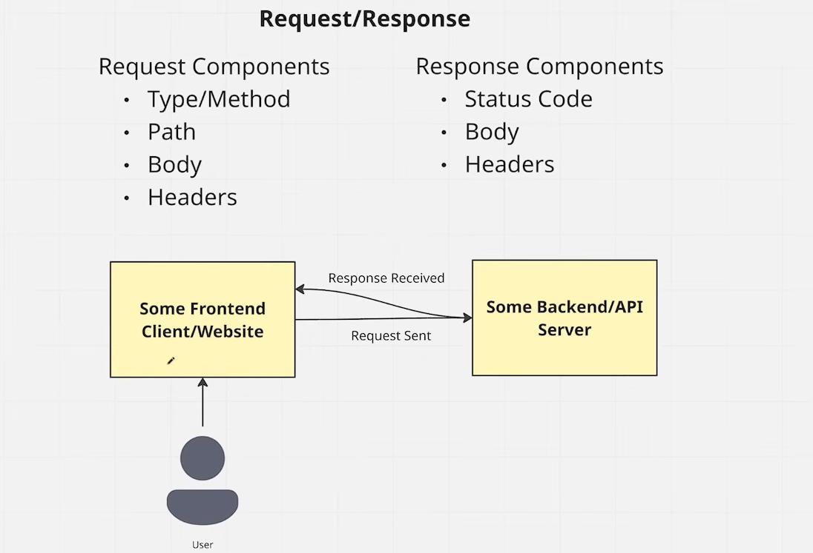
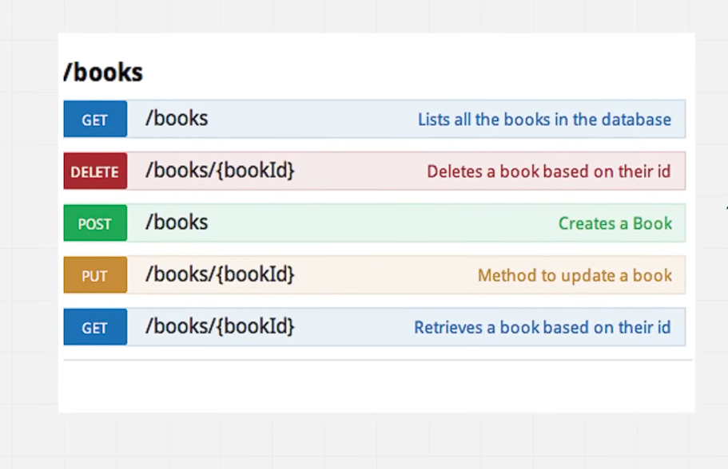
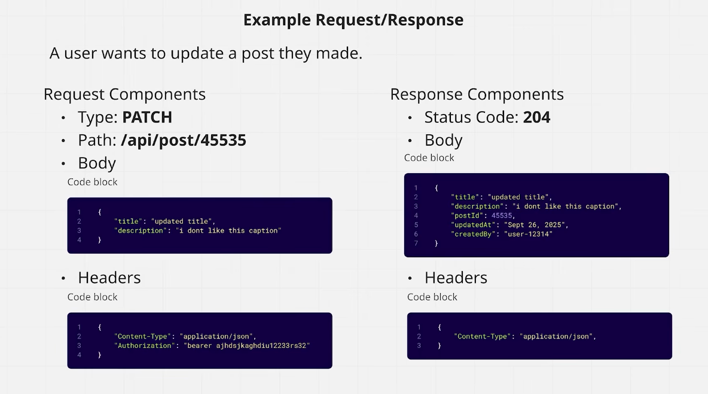

## url and Endpoints

A URL endpoint is a specific address on a server where an API receives requests and sends responses. It acts as the point of interaction between an API client (such as a web or mobile app) and the API server, enabling access to specific resources or functionalities.

An endpoint typically consists of:

- Base URL – the root address of the API server.

- Path – specifies the resource or action (e.g., /users, /posts/123).

- HTTP Method – defines the operation (e.g., GET, POST, PUT, DELETE).

- Parameters – query strings or path variables to filter or customize results.

- Headers & Body – additional request data, authentication tokens, or payloads.

#### Example:

```
GET https://api.example.com/v1/users/42

```


- Method: GET (retrieve user data)


- Base URL/Domain : https://api.example.com
    -  api is the subdomain for the API service, and example.com is the main domain.

- Path: /v1/users/42
    - v1 indicates the version of the API, users specifies the resource, and 42 is a path parameter representing a specific user ID.

- Parameter: 42 (user ID)

#### How it works:

- Client sends request to the endpoint with method, headers, parameters, and optional body.

- Server processes request – authenticates, validates, and executes logic.

- Response returned – includes status code (e.g., 200 OK, 404 Not Found) and data in formats like JSON or XML.


### request and Response

In the context of web APIs, a request is a message sent by a client to a server to perform an action or retrieve data. A response is the message sent back by the server to the client after processing the request.





#### Request
A request typically includes:
- HTTP Method: Indicates the type of action (e.g., GET, POST, PUT, DELETE).
- URL: The endpoint being accessed.
- Headers: Additional information (e.g., authentication tokens, content type).
- Body: Data sent with the request (for POST, PUT methods).
#### Response
A response typically includes:
- Status Code: Indicates the result of the request (e.g., 200 OK, 404 Not Found).
- Headers: Additional information (e.g., content type, caching directives).
- Body: The data returned by the server (e.g., JSON, XML, HTML).


### Methods
HTTP methods define the type of action to be performed on a resource. Common HTTP methods include:
- GET: Retrieve data from the server.
- POST: Send data to the server to create a new resource.
- PUT: Update an existing resource on the server.
- DELETE: Remove a resource from the server.
- PATCH: Partially update an existing resource on the server.

### Example: Books API




### HTTP Status Codes
HTTP status codes are standardized codes that indicate the result of an HTTP request. They are grouped into five categories based on their first digit:
- 1xx (Informational): Request received, continuing process.
- 2xx (Successful): Request successfully processed (e.g., 200 OK, 201 Created).
- 3xx (Redirection): Further action needed to complete the request (e.g., 301 Moved Permanently, 302 Found).
- 4xx (Client Error): Request contains bad syntax or cannot be fulfilled (e.g., 400 Bad Request, 404 Not Found).
- 5xx (Server Error): Server failed to fulfill a valid request (e.g., 500 Internal Server Error, 503 Service Unavailable).


### Example




### FastAPI Basics 
FastAPI is a modern, fast (high-performance) web framework for building APIs with Python 3.6+ based on standard Python type hints. It is designed to be easy to use and to help developers create APIs quickly and efficiently.

#### Installation
To install FastAPI, you can use pip:

```bash
pip install fastapi
```
You will also need an ASGI server to run your FastAPI application. One popular choice is Uvicorn:

```bash
pip install uvicorn
```
#### Creating a Basic FastAPI Application
Here is a simple example of a FastAPI application:

```python
from fastapi import FastAPI
app = FastAPI()
@app.get("/")
def read_root():
    return {"Hello": "World"}
```
In this example, we create a FastAPI application and define a single route ("/") that returns a JSON response with the message "Hello World".
#### Running the Application
To run the FastAPI application, you can use Uvicorn:

```bash
uvicorn main:app --reload
```
In this command, `main` refers to the name of the Python file (without the .py extension) where the FastAPI application is defined, and `app` is the instance of the FastAPI application. The `--reload` flag enables auto-reloading of the server when code changes are detected, which is useful during development.