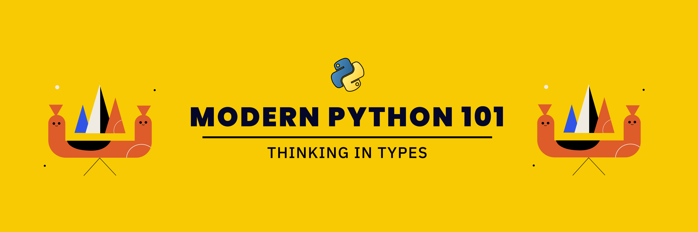

# Modern Python 101 - Thinking With Types

This is your guide to get started with Python Programming Language. This is a simple to understand and free guide to learn Python, we don't expect you to have any programming knowledge and teach everything from scratch.

Did you check instagram today or watched YouTube? Well, you just used Python based applications! All fortune 500 companies use Python in some form or another, so fear not, learning Python is always a good decision!

Python is the perfect language to learn for beginners. With Python you can do almost anything, create your own web applications, create games, desktop applications, data science projects, AI, etc, the list is endless! Python is well suited for beginners because of its simplicity and you would be writing your own programs in no time!

Python is one of the easiest language to learn, while this may be true, but it often takes a lot of time and practice to really master it. People often confuse learning `language syntax` with learning `programming`, we make this difference very clear and guide you through the basic principles needed to learn Python in an efficient manner.

Remember, this course is just your start and there is no end to learning it!

## Learning Journey

It may take you multiple times to go through any particular Topic/Video/Concept and there is no shame in it. Anyone who says they got the concept in the first try are either really smart or lying, rest of us need repetition and practice to learn anything new.

Also remember, as a beginner there is no such thing as silly questions, so be sure to ask whatever you think is a genuine question.

## Topics Covered

Following is the list of topics covered, they are listed in no specific order and are to just give you an idea of topic we would be learning in this tutorial.

1. Introduction -
   1. Why you should learn Python?
   2. What is Python?
   3. How Python Works?
   4. Hello World - Your First Python Program
   5. Installing Python
   6. Setting Up VS Code & Additional Dependencies
2. Type System -
   1. Declaring Variables
   2. Variable Rules
   3. Data Types
3. Control Flow -
   1. If / Else Statements With Python
   2. And / OR statements in Python
   3. For Loops In Python
   4. For and In Loops in Python
   5. While Loops in Python
4. Data Structures -
   1. List
   2. Tuple
   3. Dictionary
   4. Set
5. Functions -
   1. What is a Python Function?
   2. Python Functions | Take Something -> Give Something
   3. Data Transformation
   4. Side Effects
   5. Arguments
   6. Variable Local & Global Scope
   7. Unpacking in Python
   8. Variable & Keyword Arguments in Python | *args and **kwargs
   9. Deeper Dive in Functions - A Look at Higher Order Functions(HOF) & Lambda
6. Object Oriented Programming (OOP) -
   1. Introduction to Classes
   2. Not Everything Needs To Be a Class
   3. Data & Behavior - Attributes, Fields/Members, Methods
   4. Create Your First Python Class
   5. What Do You Mean By Class Instances?
   6. Adding Methods or Behavior to Your Python Class
   7. Introduction to Magic Methods
   8. Inheritance & Polymorphism
   9. Deeper Dive in OOPs - Class methods, Static methods, Property, Getters & Setters
7. Error Handling -
   1. Try - Catch - Else - Final blocks
   2. Runtime Errors, Syntax Errors, etc.
   3. Common Error types - TypeError, AssertionError, ZeroDivisionError, etc.
   4. Raising Exceptions
8. Packages -
   1. Need for packages
   2. Modules vs Packages
   3. Local modules
   4. Package initialization
   5. Package modules
9. Projects -
   1. Cash Register -> VOC-DTP Walk through
   2. Game - Save Zortan -> Thinking In Layers
10. What To Learn Next -
    1. File & Folder Handling
    2. Iterators & Generators
    3. List Comprehensions
    4. Data serialization and de-serialization
    5. Decorators
    6. Abstract Base Classes
    7. OOP's
    8. Multi-Threading & Multi-Processing
    9. Concurrency & Asyncio
    10. Testing
    11. Web Frameworks - Django, Flask & Fastapi
    12. Machine Learning & Deep Learning

## Final Words

Last But Most Important - Solve More Problems...!!!

## Contact

I would love to hear any feedback from you!

Website - [www.octallium.com](https://www.octallium.com)

Twitter - [@octallium](https://twitter.com/octallium)

YouTube - [Octallium](https://www.youtube.com/channel/UCd0MaWAxZklFtCyNPEpSl0w)
